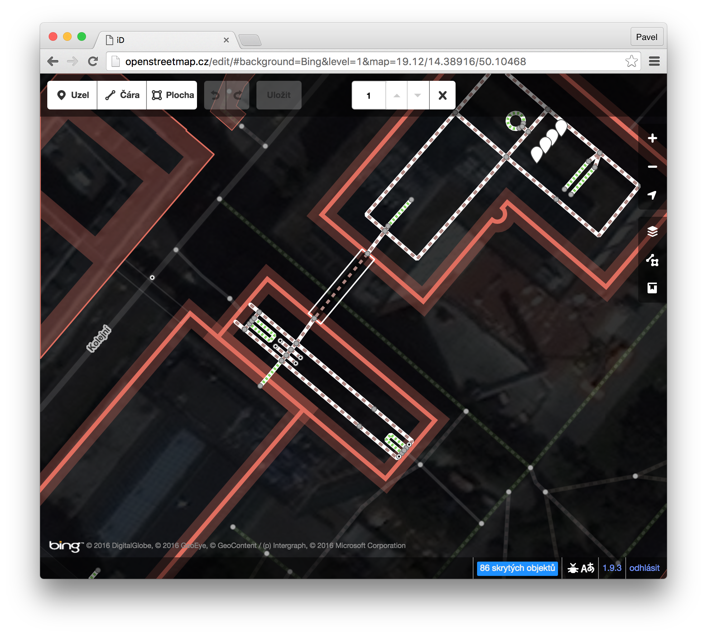

# Indoor mapping on the OpenStreetMap platform

- **Updated text** - in Google docs, feel free to comment: (Summer 2016)
  - [Czech full version](https://goo.gl/SVZyJv)
  - [English translation](https://goo.gl/vaOLWJ)

- **OSM Proposal**
  - http://wiki.osm.org/Proposed_features/CoreIndoor
  - notice in [tagging maillist](https://lists.openstreetmap.org/pipermail/tagging/2017-February/031123.html)

- **customized iD editor**
  - pull request: [github.com/openstreetmap/iD/pull/3097](https://github.com/openstreetmap/iD/pull/3097)
  - live build: [openstreetmap.cz/edit](https://openstreetmap.cz/edit)
  - tagging example: [shopping center Smichov](https://openstreetmap.cz/edit/#id=w382843342&map=18.06/14.40284/50.07310)
  
- **Original printed text in PDF:** [thesis.pdf](thesis.pdf) (April 2016)

## Abstract
This thesis deals with indoor mapping. It offers insights on current services and trends in this area. It thoroughly focuses on the OpenStreetMap platform, evaluates previously published tagging schemes and suggests improvements. It shows the process of extending the current web editor iD.

## [CZ] Plány budov na platformě OpenStreetMap
Práce se zabývá problematikou vnitřních plánů budov, nabízí informace o současných službách a trendech v této oblasti. Důkladně se zaměřuje na platformu OpenStreetMap, hodnotí dosud zveřejněné metodiky a navrhuje vylepšení. Ukazuje také průběh implementace rozšíření do webového editoru iD.

## Citation
Pavel Zbytovský: Plány budov na platformě OpenStreetMap. Diplomová práce. Praha: ČVUT FIT, 2016. Dostupný také z http://zby.cz/thesis.
